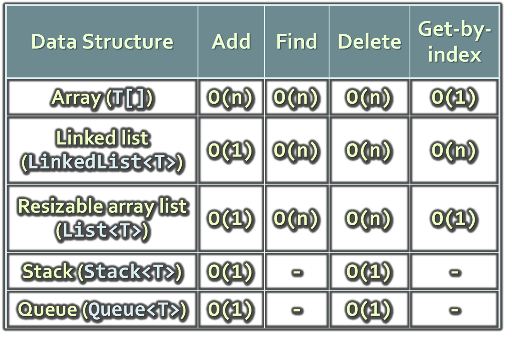
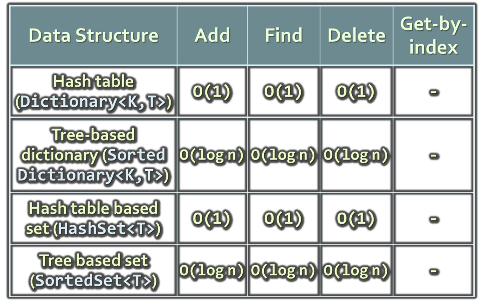

<!-- section start -->
<!-- attr: { class:'slide-title', showInPresentation:true, hasScriptWrapper:true, style:'' } -->
# Data Structures Efficiency
##  Computational Complexity of FundamentalData Structures, Choosing a Data Structure

    
Data Structures and Algorithms

    
Telerik Software Academy

    <a href="http://academy.telerik.com" class="signature-link">http://academy.telerik.com</a>

<!-- attr: { showInPresentation:true, hasScriptWrapper:true, style:'' } -->
# Table of Contents
* Fundamental Data Structures – Comparison
  * Arrays
  * Lists
  * Trees
  * Hash-Tables
  * Sets
  * Bags
* Choosing Proper Data Structure

<!-- section start -->
<!-- attr: { class:'slide-section', showInPresentation:true, hasScriptWrapper:true, style:'' } -->
# Comparing Data Structures
##  Time Complexity of Basic Operations

<!-- attr: { showInPresentation:true, hasScriptWrapper:true, style:'' } -->
# Data Structures Efficiency

<!-- attr: { showInPresentation:true, hasScriptWrapper:true, style:'' } -->
<!-- # Data Structures Efficiency -->

<!-- attr: { showInPresentation:true, hasScriptWrapper:true, style:'' } -->
# Choosing Data Structure
* Arrays (`T[]`)
  * Use when fixed number of elements should be processed by index
* Resizable array lists (`List<T>`)
  * Use when elements should be added and processed by index
* Linked lists (`LinkedList<T>`)
  * Use when elements should be added at the both sides of the list
  * Otherwise use resizable array list (`List<T>`)

<!-- attr: { showInPresentation:true, hasScriptWrapper:true, style:'font-size:0.95em' } -->
<!-- # Choosing Data Structure -->
* Stacks (`Stack<T>`)
  * Use to implement LIFO (last-in-first-out) behavior
  * `List<T>` could also work well
* Queues (`Queue<T>`)
  * Use to implement FIFO (first-in-first-out) behavior
  * `LinkedList<T>` could also work well
* Hash table based dictionary (`Dictionary<K,T>`)
  * Use when key-value pairs should be added fast and searched fast by key
  * Elements in a hash table have no particular order

<!-- attr: { showInPresentation:true, hasScriptWrapper:true, style:'font-size:0.95em' } -->
<!-- # Choosing Data Structure -->
* Balanced search tree based dictionary (`SortedDictionary<K,T>`)
  * Use when key-value pairs should be added fast, searched fast by key and enumerated sorted by key
* Hash table based set (`HashSet<T>`)
  * Use to keep a group of unique values, to add and check belonging to the set fast
  * Elements are in no particular order
* Search tree based set (`SortedSet<T>`)
  * Use to keep a group of ordered unique values

<!-- attr: { showInPresentation:true, style:'font-size:0.95em' } -->
# Summary
* `Algorithm complexity` is rough estimation of the number of steps performed by given computation
  * Complexity can be **logarithmic**, **linear**, **n log n**, **square**, **cubic**, **exponential**, etc.
  * Allows to estimating the speed of given code before its execution
* Different data structures have different efficiency on different operations
  * The fastest add / find / delete structure is the hash table – `O(1)` for all these operations

<!-- section start -->
<!-- attr: { id:'questions', class:'slide-section' } -->
# Questions
## Data Structures Efficiency
[link to Telerik Academy Forum](http://telerikacademy.com/Forum/Category/15/data-structures-algorithms)
