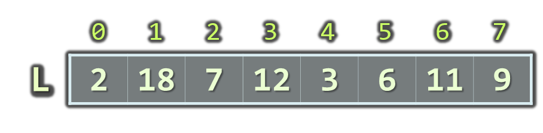
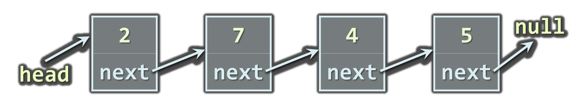
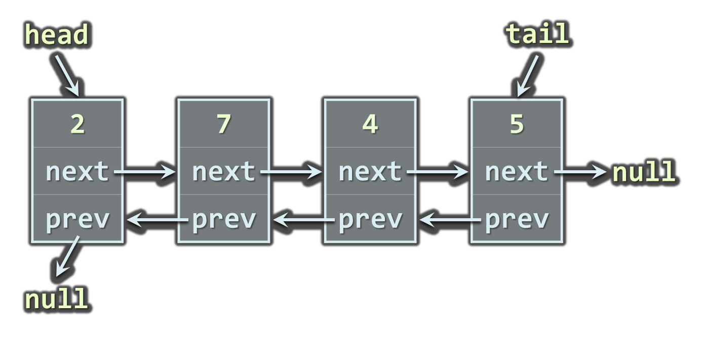
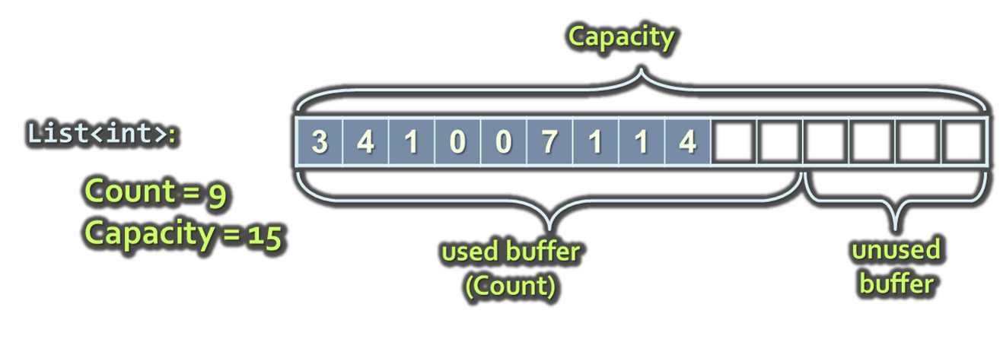
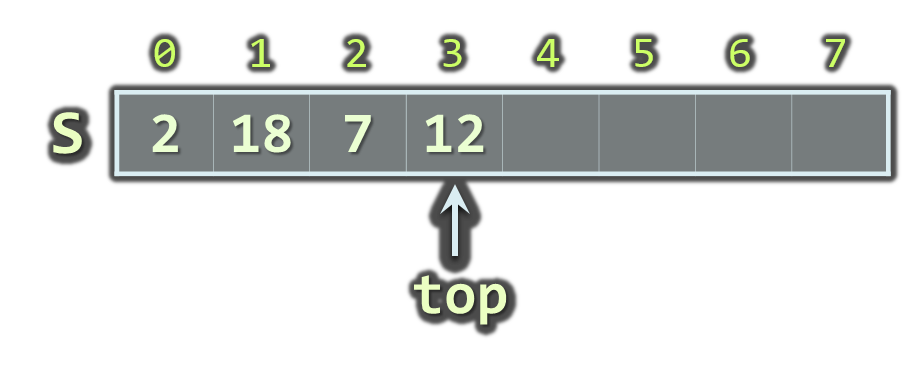
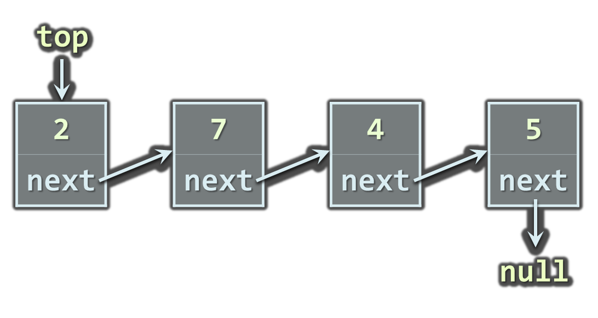
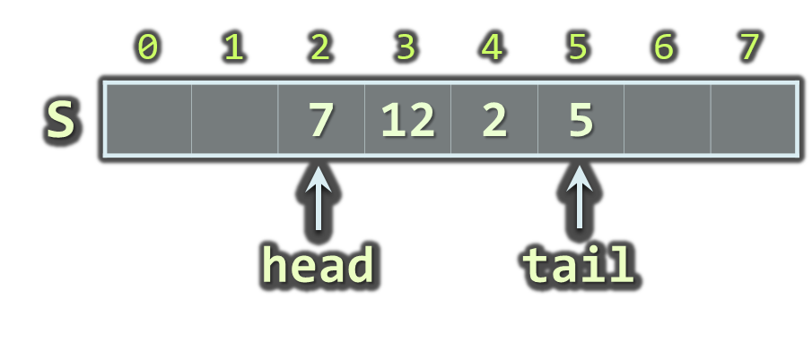
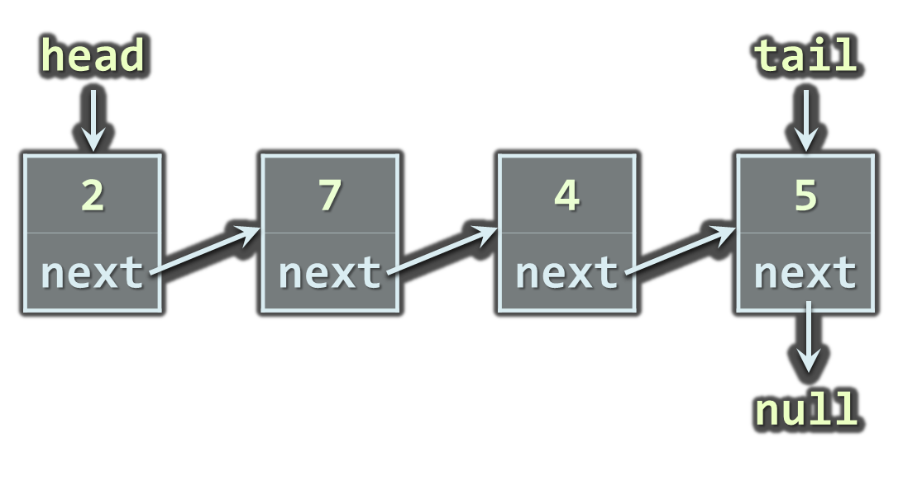
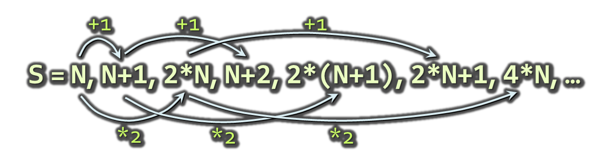
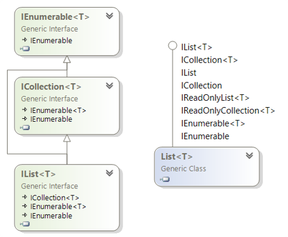

<!-- section start -->
<!-- attr: { id:'', class:'slide-title', showInPresentation:true, hasScriptWrapper:true, style:'font-size:1em' } -->
# Linear Data Structures
## Arrays, Lists, Stacks, Queues Static and Dynamic Implementation

<div class="signature">
    <p class="signature-course">Data Structures and Algorithms</p>
    <p class="signature-initiative">Telerik Software Academy</p>
    <a href="http://academy.telerik.com" class="signature-link">http://academy.telerik.com</a>
</div>

<!-- section start -->
<!-- attr: { id:'', class:'', showInPresentation:true, hasScriptWrapper:true, style:'font-size:1em' } -->
# Table of Contents
- Lists
  - Static and Linked Implementation
  - `List<T>` and `LinkedList<T>`
- Stacks
  - Static and Linked Implementation
  - The `Stack<T>` Class
- Queues
  - Circular and Linked Implementation
  - The `Queue<T>` Class


<!-- section start -->
<!-- attr: { id:'lists', class:'slide-section', showInPresentation:true, hasScriptWrapper:true, style:'font-size:1em' } -->
# Lists
## Static and Dynamic Implementations


<!-- attr: { id:'', class:'', showInPresentation:true, hasScriptWrapper:true, style:'font-size:1em' } -->
# The List ADT
- What is "`list`"?
  - A data structure (container) that contains a sequence of elements
    - Can have variable size
    - Elements are arranged linearly, in sequence
  - Can be implemented in several ways
    - Statically (using array &rarr; fixed size)
    - Dynamically (linked implementation)
    - Using resizable array (the `List<T>` class)


<!-- attr: { hasScriptWrapper:true } -->
# Static List
- Implemented by an array
  - Provides direct access by index
  - Has fixed capacity
  - Insertion, deletion and resizing are slow operations



<!-- attr: { showInPresentation:true, hasScriptWrapper:true } -->
# Linked List
- Dynamic (pointer-based) implementation
- Different forms
  - Singly-linked and doubly-linked
  - Sorted and unsorted
- Singly-linked list
  - Each `item` has 2 fields: `value` and `next`




<!-- attr: { showInPresentation:true, hasScriptWrapper:true } -->
<!-- # Linked List -->
- Doubly-linked List
  - Each item has 3 fields: `value`, `next` and `prev`




<!-- section start -->
<!-- attr: { id:'the-list-class', class:'slide-section', showInPresentation:true, hasScriptWrapper:true } -->
<!-- # The `List<T>` Class
## Auto-Resizable Indexed Lists -->


<!-- attr: { id:'', class:'', showInPresentation:true, hasScriptWrapper:true, style:'font-size:1em' } -->
# The `List<T>` Class
- Implements the abstract data structure list using an array 
  - All elements are of the same type T
  - `T` can be any type, e.g. `List<int>`, `List<string>`, `List<DateTime>`
  - Size is dynamically increased as needed
- Basic functionality:
  - `Count` – returns the number of elements 
  - `Add(T)` – appends given element at the end


<!-- attr: { showInPresentation:true, hasScriptWrapper:true, style:'font-size:1em' } -->
# `List<T>` – Simple Example
```cs
static void Main()
{
   List<string> list = new List<string>() { "C#", "Java" };
   list.Add("SQL");
   list.Add("Python");
   foreach (string item in list)
   {
      Console.WriteLine(item);
   }
   // Result:
   //   C#
   //   Java
   //   SQL
   //   Python
}
```
<div class="fragments balloon" style="width:300px; right:5%; top:32%" >Inline initialization: the compiler adds specified elements to the list</div>


<!-- attr: { class:'slide-section demo', showInPresentation:true, hasScriptWrapper:true, style:'font-size:1em' } -->
<!-- # `List<T>` – Simple Example -->
## [Demo]()


<!-- attr: { hasScriptWrapper:true } -->
# `List<T>` – Functionality
- `list[index]` – access element by index
- `Insert(index, T)` – inserts given element to the list at a specified position
- `Remove(T)` – removes the first occurrence of given element
- `RemoveAt(index)` – removes the element at the specified position
- `Clear()` – removes all elements
- `Contains(T)` – determines whether an element is part of the list


<!-- attr: { showInPresentation:true, hasScriptWrapper:true } -->
<!-- # List<T> – Functionality -->
- `IndexOf()` – returns the index of the first occurrence of a value in the list (zero-based)
- `Reverse()` – reverses the order of the elements in the list or a portion of it
- `Sort()` – sorts the elements in the list or a portion of it
- `ToArray()` – converts the elements of the list to an array
- `TrimExcess()` – sets the capacity to the actual number of elements


<!-- attr: { showInPresentation:true, hasScriptWrapper:true } -->
# `List<T>`: How It Works?
- `List<T>` keeps a buffer memory, allocated in advance, to allow fast `Add(T)`
  - Most operations use the buffer memory and do not allocate new objects
  - Occasionally the capacity grows (doubles)



<!-- attr: {hasScriptWrapper:true, style:'font-size:0.9em' } -->
# Primes in an Interval – Example
```cs
static List<int> FindPrimes(int start, int end)
{
   List<int> primesList = new List<int>();
   for (int num = start; num <= end; num++)
   {	
      bool prime = true;
      for (int div = 2; div <= Math.Sqrt(num); div++)
      {
         if (num % div == 0)
         {
            prime = false;
            break;
         }	
      }
      if (prime)
      {
         primesList.Add(num);
      }
   }
   return primesList;
}
```

<!-- attr: { class:'slide-section demo', showInPresentation:true } -->
<!-- # Primes in an Interval -->
## [Demo]()


<!-- attr: { hasScriptWrapper:true } -->
# Union and Intersection – Example
```cs
int[] Union(int[] firstArr, int[] secondArr)
{
   List<int> union = new List<int>();
   union.AddRange(firstArray);
   foreach (int item in secondArray)
      if (! union.Contains(item))
         union.Add(item);
   return union.ToArray();
}
int[] Intersection(int[] firstArr, int[] secondArr)
{
   List<int> intersect = new List<int>();
   foreach (int item in firstArray)
      if (Array.IndexOf(secondArray, item) != -1)
         intersect.Add(item);
   return intersect.ToArray();
}
```


<!-- attr: { class:'slide-section demo', showInPresentation:true } -->
<!-- # Union and Intersection -->
## [Demo]()

<!-- section start -->
<!-- attr: { class:'slide-section', showInPresentation:true, hasScriptWrapper:true } -->
<!-- # The `LinkedList<T>` Class
## Dynamic Linked List in .NET -->


<!-- attr: { id:'', class:'', showInPresentation:true, hasScriptWrapper:true, style:'font-size:1em' } -->
# The `LinkedList<T>` Class
- Implements the abstract data structure list using a doubly-linked dynamic structure
  - All elements are of the same type `T`
  - `T` can be any type, e.g. `LinkedList<int>`, `LinkedList<string>`, etc.
  - Elements can be added at both sides
- Basic `LinkedList<T>` functionality:
  - `AddFirst(T)`, `AddLast(T)`, `AddBefore(T)`, `AddAfter(T)`, `RemoveFirst(T)`, `RemoveLast(T)`, `Count`


<!-- attr: { id:'', class:'', showInPresentation:true, hasScriptWrapper:true, style:'font-size:1em' } -->
# `LinkedList<T>` – Example
```cs
  static void Main()
  {
      LinkedList<string> list =
          new LinkedList<string>();
      list.AddFirst("First");
      list.AddLast("Last");
      list.AddAfter(list.First, "After First");
      list.AddBefore(list.Last, "Before Last");
  
      Console.WriteLine(String.Join(", ", list));
  
      // Result: First, After First, Before Last, Last
  }
```


<!-- attr: { class:'slide-section demo', showInPresentation:true } -->
<!-- # LinkedList<T> -->
## [Demo]()


<!-- section start -->
<!-- attr: { id:'sorting-lists', class:'slide-section', showInPresentation:true, hasScriptWrapper:true } -->
<!-- # Sorting Lists
## Several Ways to Do It -->


<!-- attr: { id:'', class:'', showInPresentation:true, hasScriptWrapper:true, style:'font-size:1em' } -->
# Sorting Lists
```cs
  List<DateTime> list = new List<DateTime>()
  {
      new DateTime(2013, 4, 7),
      new DateTime(2002, 3, 12),
      new DateTime(2012, 1, 4),
      new DateTime(1980, 11, 11)
  };

  list.Sort();

  list.Sort((d1, d2) => -d1.Year.CompareTo(d2.Year));

  list.OrderBy(date => date.Month)));
```


<!-- attr: { class:'slide-section demo', showInPresentation:true } -->
<!-- # Sorting Lists -->
##  [Demo]()


<!-- section start -->
<!-- attr: { id:'stacks', class:'slide-section', showInPresentation:true, hasScriptWrapper:true, style:'font-size:1em' } -->
# Stacks
## Static and Dynamic Implementation


# The Stack ADT
- LIFO (Last In First Out) structure 
- Elements inserted (push) at "top"
- Elements removed (pop) from "top"
- Useful in many situations
  - E.g. the execution stack of the program 
- Can be implemented in several ways
  - Statically (using array)
  - Dynamically (linked implementation)
  - Using the `Stack<T>` class


<!-- attr: { hasScriptWrapper:true } -->
# Static Stack
- Static (array-based) implementation
  - Has limited (fixed) capacity
  - The current index (`top`) moves left / right with each pop / push




<!-- attr: { hasScriptWrapper:true } -->
# Linked Stack
- Dynamic (pointer-based) implementation
  - Each `item` has 2 fields: `value` and `next`
  - Special pointer keeps the top element




<!-- attr: { class:'slide-section', showInPresentation:true, hasScriptWrapper:true } -->
<!-- # The `Stack<T>` Class
## The Standard Stack Implementation in .NET -->


<!-- attr: { hasScriptWrapper:true } -->
# The `Stack<T>` Class
- Implements the `stack` data structure using an array
  - Elements are from the same type `T`
  - `T` can be any type, e.g. `Queue<int>`   
  - Size is dynamically increased as needed
- Basic functionality:
  - `Push(T)` – inserts elements to the stack
  - `Pop()` – removes and returns the top element from the stack


<!-- attr: { showInPresentation:true, hasScriptWrapper:true } -->
<!-- # The Stack<T> Class -->
- Basic functionality:
  - `Peek()` – returns the top element of the stack without removing it
  - `Count` – returns the number of elements
  - `Clear()` – removes all elements
  - `Contains(T)` – determines whether given element is in the stack
  - `ToArray()` – converts the stack to an array
  - `TrimExcess()` – sets the capacity to the actual number of elements 


<!-- attr: { hasScriptWrapper:true, style:'font-size:1em' } -->
# `Stack<T>` – Example
- Using `Push()`, `Pop()` and `Peek()` methods

```cs
static void Main()
{
    Stack<string> stack = new Stack<string>();
    stack.Push("1. Ivan");
    stack.Push("2. Nikolay");
    stack.Push("3. Maria");
    stack.Push("4. George");

    Console.WriteLine("Top = {0}", stack.Peek());

    while (stack.Count > 0)
    {
        string personName = stack.Pop();
        Console.WriteLine(personName);
    }
}
```


<!-- attr: { class:'slide-section demo', showInPresentation:true, hasScriptWrapper:true } -->
<!-- # `Stack<T>` -->
## [Demo]()


# Matching Brackets – Example
- We are given an arithmetical expression with brackets that can be nested
- Goal: **extract all sub-expressions in brackets**
- Example:
  - `1 + (2 - (2+3) * 4 / (3+1)) * 5`
- Result:
  - `(2+3) | (3+1) | (2-(2+3) * 4 / (3+1))`
- Algorithm:
  - For each '`(`' push its index in a stack
  - For each '`)`' pop the corresponding start index


<!-- attr: { id:'', class:'', showInPresentation:true, hasScriptWrapper:true, style:'font-size:1em' } -->
# Matching Brackets – Solution
```cs
string expression = "1 + (2 (2+3) * 4 / (3+1)) * 5";
Stack<int> stack = new Stack<int>();
for (int index = 0; index < expression.Length; index++)
{
    char ch = expression[index];
    if (ch == '(')
    {
       stack.Push(index);
    }
    else if (ch == ')')
    {
        int startIndex = stack.Pop();
        int length = index startIndex + 1;
        string contents =
            expression.Substring(startIndex, length);
        Console.WriteLine(contents);
    }
}
```


<!-- attr: { class:'slide-section demo', showInPresentation:true } -->
<!--# Matching Brackets -->
## [Demo]()


<!-- section start -->
<!-- attr: { id:'queues', class:'slide-section', showInPresentation:true, hasScriptWrapper:true, style:'font-size:1em' } -->
<!-- # Queues
## Static and Dynamic Implementation -->


<!-- attr: { id:'', class:'', showInPresentation:true, hasScriptWrapper:true, style:'font-size:1em' } -->
# The Queue ADT
- FIFO (First In First Out) structure
- Elements inserted at the tail (Enqueue)
- Elements removed from the head (Dequeue)
- Useful in many situations
  - Print queues, message queues, etc.
- Can be implemented in several ways
  - Statically (using array)
  - Dynamically (using pointers)
  - Using the `Queue<T>` class


<!-- attr: { id:'', class:'', showInPresentation:true, hasScriptWrapper:true, style:'font-size:1em' } -->
# Static Queue
- Static (array-based) implementation
  - Has limited (fixed) capacity
  - Implement as a "circular array"
  - Has `head` and `tail` indices, pointing to the head and the tail of the cyclic queue




<!-- attr: { id:'', class:'', showInPresentation:true, hasScriptWrapper:true, style:'font-size:1em' } -->
# Linked Queue
- Dynamic (pointer-based) implementation
  - Each item has 2 fields: `value` and `next`
  - Dynamically create and delete objects




<!-- attr: { class:'slide-section', showInPresentation:true, hasScriptWrapper:true } -->
<!-- # The `Queue<T>` Class
##  Standard Queue Implementation in .NET -->


<!-- attr: { hasScriptWrapper:true } -->
# The `Queue<T>` Class
- Implements the queue data structure using a circular resizable array
  - Elements are from the same type `T`
  - `T` can be any type, e.g. `Queue<int>` 
  - Size is dynamically increased as needed
- Basic functionality:
  - `Enqueue(T)` – adds an element to theend of the queue
  - `Dequeue()` – removes and returns the element at the beginning of the queue


<!-- attr: { showInPresentation:true, hasScriptWrapper:true } -->
<!-- # The Queue<T> Class -->
- Basic functionality:
  - `Peek()` – returns the element at the beginning of the queue without removing it
  - `Count` – returns the number of elements
  - `Clear()` – removes all elements
  - `Contains(T)` – determines whether given element is in the queue
  - `ToArray()` – converts the queue to an array
  - `TrimExcess()` – sets the capacity to the actual number of elements in the queue


<!-- attr: { hasScriptWrapper:true } -->
# `Queue<T>` – Example
- Using `Enqueue()` and `Dequeue()` methods

```cs
static void Main()
{
    Queue<string> queue = new Queue<string>();
    queue.Enqueue("Message One");
    queue.Enqueue("Message Two");
    queue.Enqueue("Message Three");
    queue.Enqueue("Message Four");

    while (queue.Count > 0)
    {
        string message = queue.Dequeue();
        Console.WriteLine(message);
    }
}
```


<!-- attr: { class:'slide-section demo', showInPresentation:true, hasScriptWrapper:true } -->
<!-- # The `Queue<T>` Class -->
##  [Demo]()


<!-- attr: { id:'', class:'', showInPresentation:true, hasScriptWrapper:true, style:'font-size:1em' } -->
# Sequence N, N+1, 2*N
- We are given the sequence:
 


- Find the first index of given number P
- Example: N = 3, P = 16
  - S = 3, 4, 6, 5, 8, 7, 12, 6, 10, 9, 16, 8, 14, …
  - Index of P = 11


<!-- attr: { id:'', class:'', showInPresentation:true, hasScriptWrapper:true, style:'font-size:1em' } -->
# Sequence – Solution with a Queue
```cs
int n = 3, p = 16;
Queue<int> queue = new Queue<int>();
queue.Enqueue(n);
int index = 0;
while (queue.Count > 0)
{
    int current = queue.Dequeue();
    index++;
    if (current == p)
    {
        Console.WriteLine("Index = {0}", index);
        return;
    }
    queue.Enqueue(current+1);
    queue.Enqueue(2*current);
}
```


<!-- attr: { class:'slide-section demo', showInPresentation:true } -->
<!-- # Sequence N, N+1, 2*N -->
## [Demo]()


<!-- section start -->
<!-- attr: { id:'list-interfaces', class:'slide-section', showInPresentation:true } -->
<!-- # List Interfaces in .NET
## `IEnumerable`, `ICollection`, `IList`, … -->


<!-- attr: { hasScriptWrapper:true } -->
# List Interfaces in .NET
- `IEnumerable`, `IEnumerable<T>`
  - `GetEnumerator()` &rarr; `Current`, `MoveNext()`
- `ICollection`, `ICollection<T>`
  - Inherits from `IEnumerable<T>`
  - `Count`, `Add(…)`, `Remove(…)`, `Contains(…)`
- `IList`, `IList<T>`
  - Inherits from `ICollection<T>`
  - `Item` / indexer `[]`, `Insert(…)`, `RemoveAt(…)`


<!-- attr: { hasScriptWrapper:true } -->
# List Interfaces Hierarchy



<!-- section start -->
<!-- attr: { id:'summary', hasScriptWrapper:true } -->
# Summary
- The basic linear data structures in the computer programming are:
  - List (static, linked)
    - Implemented by the `List<T>` and `LinkedList<T>` classes in .NET
  - Stack (static, linked)
    - Implemented by the `Stack<T>` class in .NET
  - Queue (static, linked)
    - Implemented by the `Queue<T>` class in .NET

<!-- section start -->
<!-- attr: { id:'', class:'slide-section', showInPresentation:true, hasScriptWrapper:true, style:'font-size:1em' } -->
<!-- # Linear Data Structures
## Questions -->
[link to our Forum](http://telerikacademy.com/Forum/Category/15/data-structures-algorithms)