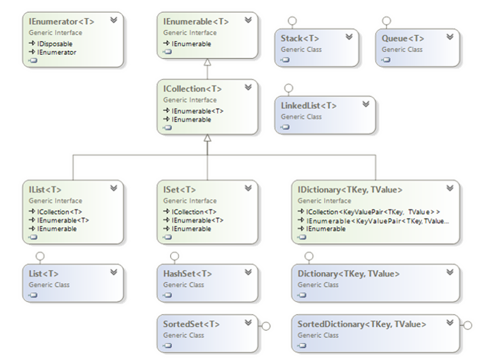
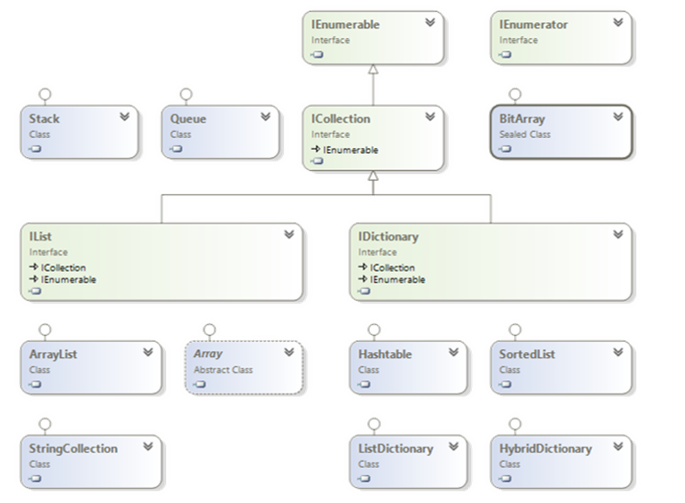
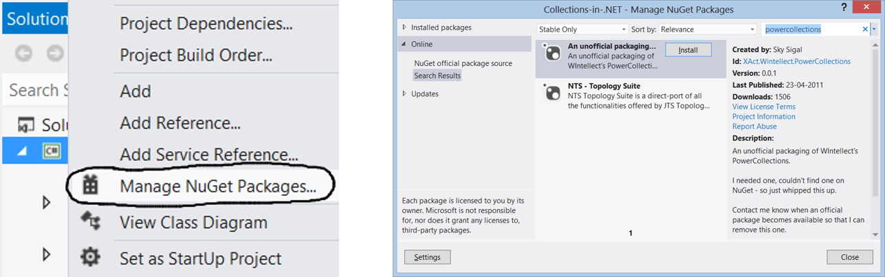
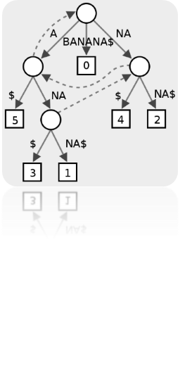
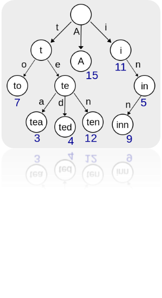
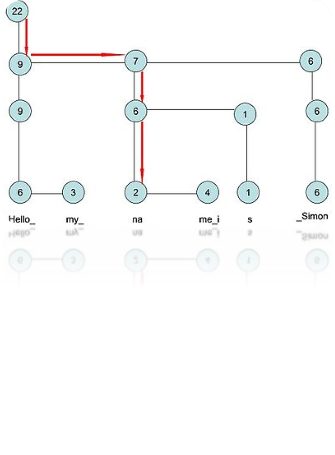
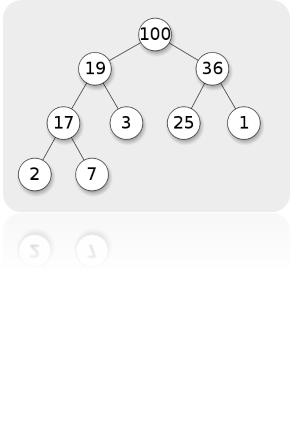
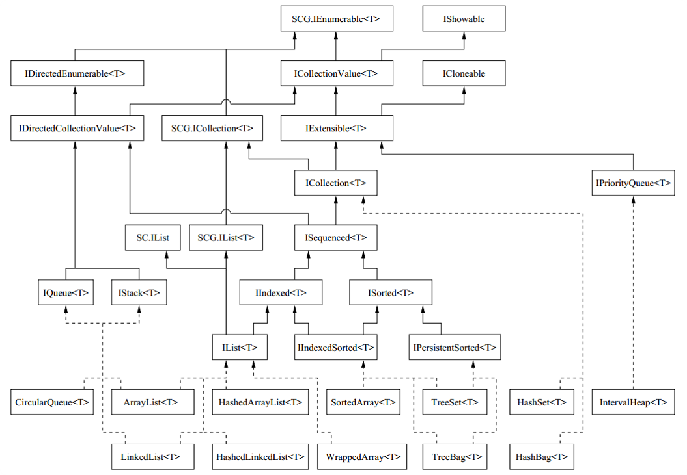

<!-- section start -->
<!-- attr: { class:'slide-title', showInPresentation:true, hasScriptWrapper:true, style:'' } -->
# Advanced Data Structures
##  Wintellect Power Collections, C5 Collections

<div class="signature">
    <p class="signature-course">Data Structures and Algorithms</p>
    <p class="signature-initiative">Telerik Software Academy</p>
    <a href="http://academy.telerik.com" class="signature-link">http://academy.telerik.com</a>
</div>


<!-- attr: { showInPresentation:true, hasScriptWrapper:true, style:'' } -->
# Table of Contents
* Standard .NET Data Structures
  * Special .NET Collections
* Wintellect Power Collections
  * Installation
  * Power Collection Classes
  * Implementing Priority Queue
* C5 Collections
* Other Advanced Data Structures
  * Suffix trees, interval trees, ropes, tries, etc.


<!-- section start -->
<!-- attr: { class:'slide-section', showInPresentation:true, hasScriptWrapper:true, style:'' } -->
# Standard .NETData Structures
##  Built-In .NET Data Structure Implementations


<!-- attr: { showInPresentation:true, hasScriptWrapper:true, style:'' } -->
# .NET Data Structures
* Linear structures
  * Lists: `List<T>`, `LinkedList<T>`
  * Stacks: `Stack<T>`
  * Queues: `Queue<T>`
* Dictionaries (maps)
  * `Dictionary<K,V>`, `SortedDictionary<K,V>`
  * No standard multi-dictionary .NET class
* Balanced search tree structures
  * `SortedSet<T>`, `SortedDictionary<K,V>`


<!-- attr: { showInPresentation:true, hasScriptWrapper:true, style:'font-size:0.95em' } -->
<!-- # .NET Data Structures -->
* Sets and bags
  * Sets – `HashSet<T>`, `SortedSet<T>`
  * Bag – no standard .NET class
* Ordered sets, bags and dictionaries
* Priority queues / heaps &rarr; no
* Special tree structures &rarr; no
  * Suffix tree, interval tree, index tree, trie
* Graphs &rarr; no
  * Directed / undirected
  * Weighted / un-weighted
  * Connected / non-connected, …


<!-- attr: { showInPresentation:true, hasScriptWrapper:true, style:'' } -->
# .NET Generic Collections



<!-- attr: { showInPresentation:true, hasScriptWrapper:true, style:'' } -->
# .NET Untyped Collections




<!-- attr: { showInPresentation:true, style:'' } -->
# Special .NET Collections
* `Collection<T>`
  * Inheritable `IList<T>`, virtual `Add()` / `Remove()`
* `ObservableCollection<T>`
  * Event `CollectionChanged`
* `IReadOnlyCollection<T>`
    * Supports only `Count` and `GetEnumerator()`
* `IReadOnlyList<T>`
  * Supports only `Count`, `[]` and `GetEnumerator()`
* Concurrent collections (thread-safe)
  * `BlockingCollection<T>`, `ConcurrentBag<T>`, …


<!-- attr: { class:'slide-section demo', showInPresentation:true, hasScriptWrapper:true, style:'' } -->
# Special .NET Collections
##  [Demo]()


<!-- section start -->
<!-- attr: { class:'slide-section', showInPresentation:true, hasScriptWrapper:true, style:'' } -->
# Wintellect Power Collections
##  Open Source C# Implementation of All Major Data Structures: Lists, Sets, Bags, Dictionaries, etc.


<!-- attr: { showInPresentation:true, hasScriptWrapper:true, style:'' } -->
# Wintellect Power Collections
* Wintellect Power Collections is powerful open-source data structure library
  * Download: http://powercollections.codeplex.com
* Installing Power Collections in Visual Studio
  * Use NuGet package manager




<!-- attr: { showInPresentation:true, hasScriptWrapper:true, style:'' } -->
# Power Collections Classes
* `Bag<T>`
  * A bag (multi-set) based on hash-table
    * Unordered collection (with duplicates)
  * Add / Find / Remove work in time O(1)
  * `T` should provide `Equals()` and `GetHashCode()`
* `OrderedBag<T>`
  * A bag (multi-set) based on balanced search tree
  * Add / Find / Remove work in time O(log(N))
  * `T` should implement `IComparable<T>`


<!-- attr: { showInPresentation:true, hasScriptWrapper:true, style:'' } -->
<!-- # Power Collections Classes -->
* `Set<T>`
  * A set based on hash-table (no duplicates)
  * Add / Find / Remove work in time O(1)
  * Like .NET’s `HashSet<T>`
* `OrderedSet<T>`
  * A set based on balanced search tree (red-black)
  * Add / Find / Remove work in time O(log(N))
  * Like .NET’s `SortedSet<T>`
  * Provides fast `.Range(from, to)` operation
  * 

<!-- attr: { showInPresentation:true, hasScriptWrapper:true, style:'' } -->
<!-- # Power Collections Classes -->
* `MultiDictionary<TKey,TValue>`
  * A dictionary (map) implemented by hash-table
  * Allows duplicates (configurable)
  * Add / Find / Remove work in time O(1)
  * Like `Dictionary<TKey,List<TValue>>`
* `OrderedDictionary<TKey,TValue>` / `OrderedMultiDictionary<TKey,TValue>`
  * A dictionary based on balanced search tree
  * Add / Find / Remove work in time O(log(N))
  * Provides fast `.Range(from,to)` operation


<!-- attr: { showInPresentation:true, hasScriptWrapper:true, style:'' } -->
<!-- # Power Collections Classes -->
* `Deque<T>`
  * Double-ended queue (deque)
* `BigList<T>`
    * Editable sequence of indexed items
    * Like `List<T>` but provides
      * Fast `Insert` / `Delete` operations (at any position)
      * Fast `Copy` / `Concat` / `Sub-range` operations
    * Implemented by the data structure "`Rope`"
      * Special kind of balanced binary tree: http://en.wikipedia.org/wiki/Rope_(data_structure)


<!-- attr: { class:'slide-section demo', showInPresentation:true, hasScriptWrapper:true, style:'' } -->
# Wintellect Power Collections
##  [Demo]()


<!-- attr: { showInPresentation:true } -->
# Priority Queue
* What is a "`priority` `queue`"?
  * Data structure to efficiently support finding the item with the highest priority
  * Like a queue, but with priorities
  *  The basic operations
    * `Enqueue(T element)`
    * `Dequeue() &rarr; T`
* There is no build-in `priority` `queue` in .NET
  * See the data structure "[binary heap](http://en.wikipedia.org/wiki/Binary_heap)"
  * Can be implemented also by `OrderedBag<T>`


<!-- attr: { showInPresentation:true, hasScriptWrapper:true, style:'font-size:0.9em' } -->
# Priority Queue Implementation

```cs
class PriorityQueue<T> where T : IComparable<T>
{
   private OrderedBag<T> queue;
   public int Count 
   {
      get { return this.queue.Count; }
   }
   public PriorityQueue()
   {
      this.queue = new OrderedBag<T>();   
   }
   public void Enqueue(T element)
   {
      this.queue.Add(element);
   }
   public T Dequeue()
   {
      return this.queue.RemoveFirst();
   }
}
```


<!-- attr: { class:'slide-section demo', showInPresentation:true, hasScriptWrapper:true, style:'' } -->
# Priority Queue
##  [Demo]()


<!-- section start -->
<!-- attr: { class:'slide-section', showInPresentation:true, hasScriptWrapper:true, style:'' } -->
# Advanced Data Structures
##  Suffix Trees, Interval Trees, Tries, Ropes, Heaps, …


<!-- attr: { showInPresentation:true, hasScriptWrapper:true, style:'' } -->
# Advanced Data Structures
* **Suffix tree** (position tree)
  * Represents the suffixes of given string
  * Used to implement fast search in string
* **Trie** (prefix tree)
  * Special tree structure used for <br/>fastmulti-pattern matching
* **Rope**
  * Balanced tree structure for indexeditems with fast inserts / delete
  * Allows fast string edit operations






<!-- attr: { showInPresentation:true, hasScriptWrapper:true, style:'' } -->
<!-- # Advanced Data Structures -->
* **Interval tree**
  * Keeps intervals [a…b] in ordered balanced tree
  * Allows to efficiently find all intervals that overlap with any given interval or point
* **Binary heap**, **Fibonacci heap**
  * Special tree-like data structures <br/>toefficiently implement a priority queue
* **Index trees**
  * Used to keep sorted indices of database records
  * B-tree, B+ tree, T-tree



<!-- section start -->
<!-- attr: { class:'slide-section', showInPresentation:true, hasScriptWrapper:true, style:'' } -->
# C5 Collections
##  Open Source Generic Collection Library for C#


<!-- attr: { showInPresentation:true, hasScriptWrapper:true, style:'' } -->
# C5 Collections
* What are "C5 Collections"?
  * C5 Generic Collection Library for C# and CLI
  * Open-Source Data Structures Library for .NET
  * http://www.itu.dk/research/c5/
  * Have solid documentation ([book](http://www.itu.dk/research/c5/latest/ITU-TR-2006-76.pdf))
  * The C5 library defines its own interfaces like
    * `IEnumerable<T>`
    * `IIndexed<T>`
    * `IIndexedSorted<T>`
    * etc.

<!-- attr: { showInPresentation:true, hasScriptWrapper:true, style:'' } -->
# C5 Collection Classes



<!-- attr: { showInPresentation:true, hasScriptWrapper:true, style:'' } -->
# C5 Collection Classes
* Classical collection classes
  * `ArrayList<T>`, `LinkedList<T>`, `CircularQueue<T>`, `HashSet<T>`, `TreeSet<T>`, `HashBag<T>`, `TreeBag<T>`
* `HashedArrayList<T>`
  * Combination of indexed list + hash-table
  * Fast `Add` / `Find` / `indexer []` &rarr; O(1)
* `IntervalHeap<T>`
  * Efficient double-ended priority queue

<!-- section start -->
<!-- attr: {id: 'questions', class: 'slide-section'} -->
# Questions
## Advanced Data Structures
[link to Telerik Academy Furum](https://telerikacademy.com/Forum/Category/15/data-structures-algorithms)


